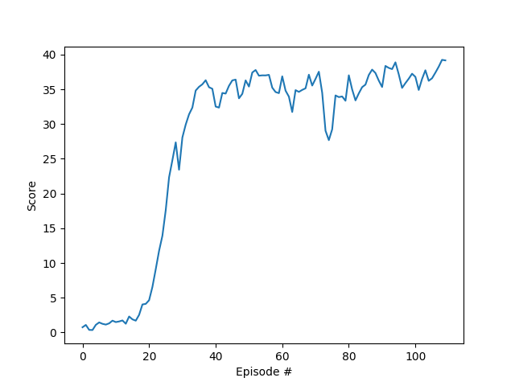

## Continuous Control Project Report

## Learning Algorithm

In this project, the agent's goal is to follow a moving target as long as possible. The agent has full access to the
state (33 variables) of the environment, and 4 continuous movements as its actions. Through interacting with the
environment, the agent receives positive rewards when reaches the target.

In this project, we deploy the actor-critic strategy, where we use two neural networks (actor and critic). As described
in the [ddpg paper](https://arxiv.org/abs/1509.02971). The actor network, uses the policy gradient technique to predict
the actions directly from current observed state. On the other hand, the critic network try to estimate the Q-value,
where input is the observed state and the actions, output is the Q value. The actor network is having low bias and high
variance, while the critic network is having high bias due to the dependence to temperal difference, but low variance.
Combining both networks, combines the best of two worlds, low bias and low variance.

In the project, the 20 agent unity environment is used. Detailed Algorith refer to "Algorithm 1 DDPG algorithm"
in [ddpg paper](https://arxiv.org/abs/1509.02971).

Different from the original algorithm, instead using Ornstein-Uhlenbeck process to model the noise for actions, a 0
centered Gaussian distributed noise with std-dev 0.05. The noise will decay exponentially with 0.99 every episode.

Hyperparameters:

```python
BUFFER_SIZE = int(1e5)  # replay buffer size
BATCH_SIZE = 64  # minibatch size
GAMMA = 0.99  # discount factor
TAU = 1e-3  # for soft update of target parameters
LR_ACTOR = 5.e-4  # learning rate of the actor
LR_CRITIC = 5.e-3  # learning rate of the critic
exponential_learning_decay = 0.98  # for both actor and critic networks
```

#### Actor-Critic Network Architectures

Actor network:


Critic Network:


### Plot of Rewards

The training will terminate once average score reaches 30 over +100 episodes.

The network converges in **36** episodes, and kept stably at the score of ~35.

The score per episode during training:



### Demo

Runing the trained model with no exploration noise


It reaches score of 38 at the end of the episode

### Ideas for Future Work

- A huge amount of time was spent tuning hyper-parameters, a small change would result in big difference. Apply grid
  search to tune them systematically.
- Use priority reply buffer
- In the course PPO and A3C are also introduced, but for discrete action space. I wonder how they can be also used in
  continuous space.
